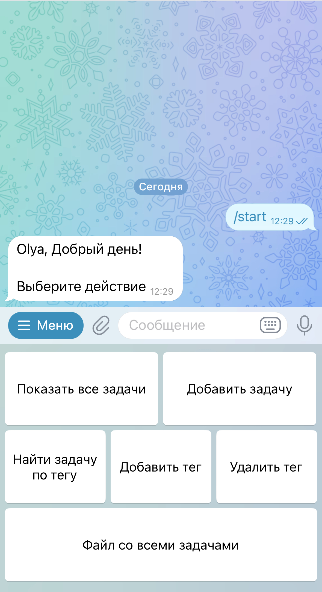
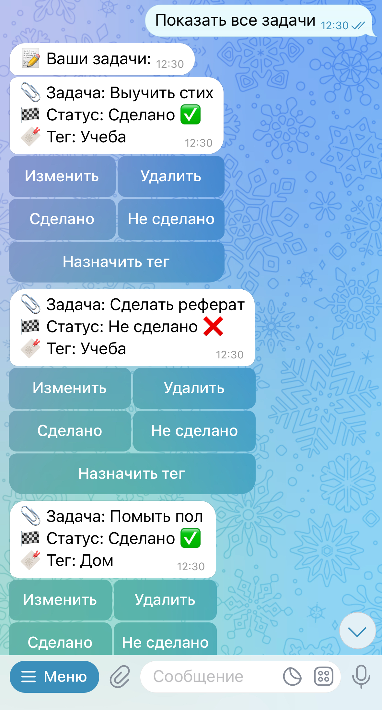
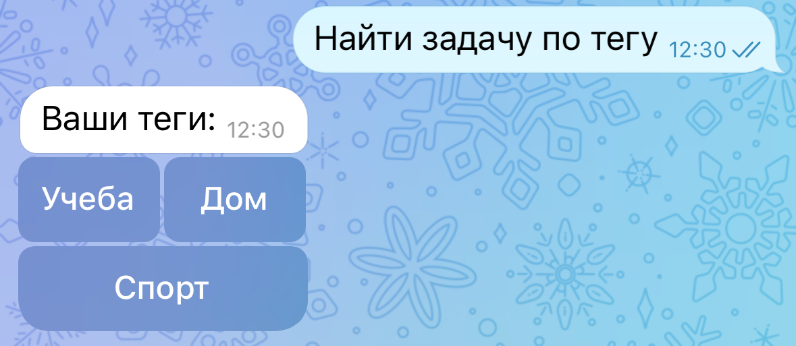
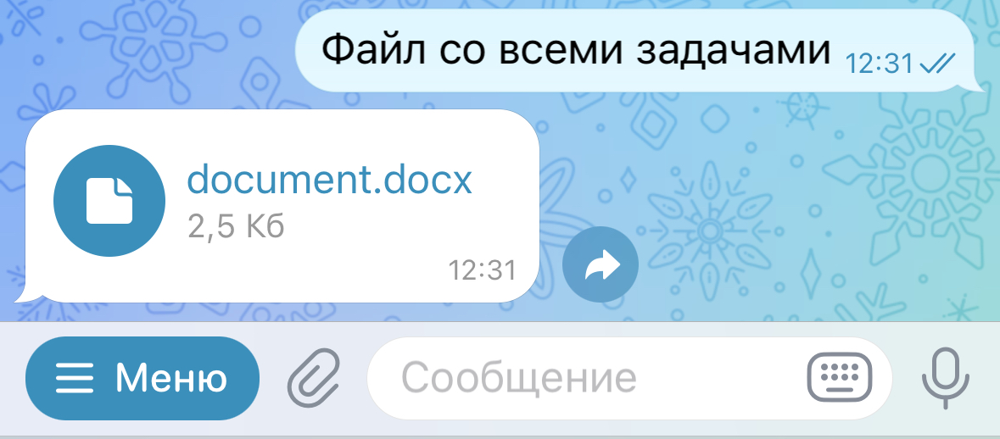
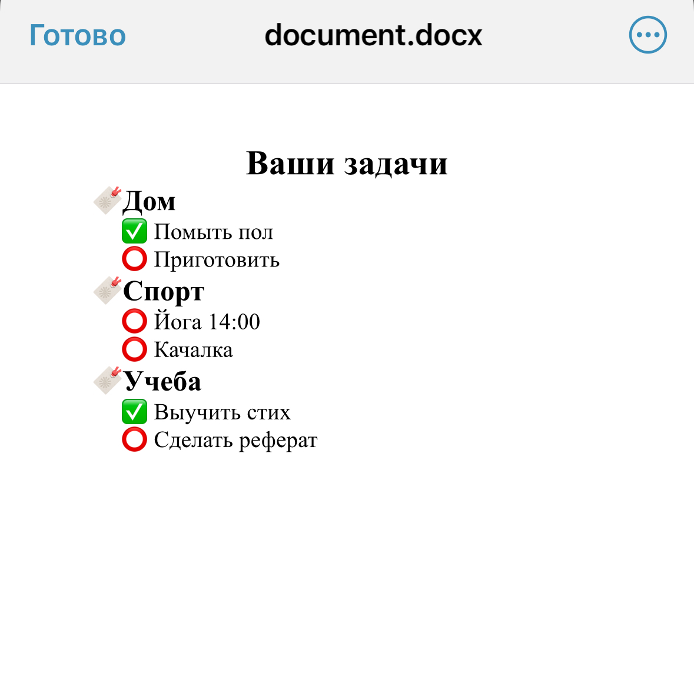

# Dashboard Telegram Bot
## Описание:
Данный Telegram bot представляет из себя
**Spring-приложение**, работающее с
локально установленной базой данных **PostgreSQL**.
Бот позволяет отслеживать задачи, изменять их статус, а также предоставляет пользователям возможность
выполнять поиск задач по тегу и просматривать свои задачи в формате Word.

### Stack
Java, Spring Boot, Telegram long polling, Maven, JDBC, Hibernate, SQL, Lombok, Poi Word.

## Word файл с задачами пользователя

